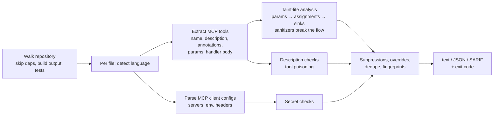

<h1 align="center">mcp-guard</h1>

<p align="center">
  <b>Security linter for MCP (Model Context Protocol) servers.</b><br>
  Finds command injection, path traversal, leaked secrets, tool poisoning and prompt-injection risks<br>
  before an AI agent (or someone steering it) does.
</p>

<p align="center">
  <a href="https://github.com/Gerijacki/mcp-guard/actions/workflows/ci.yml"></a>
  <a href="https://github.com/Gerijacki/mcp-guard/releases/latest"></a>
  <a href="https://goreportcard.com/report/github.com/Gerijacki/mcp-guard"></a>
  <a href="https://pkg.go.dev/github.com/Gerijacki/mcp-guard"></a>
  <a href="LICENSE"></a>
</p>

<p align="center">
  
</p>

---

**mcp-guard** statically analyzes MCP servers written in **Python, TypeScript/JavaScript and Go**, and the MCP client configs that wire them into agents (`mcp.json`, `claude_desktop_config.json`, `.vscode/mcp.json`, Cursor, Windsurf, …). It understands MCP itself: it finds every tool, its description and annotations, and follows the model-controlled parameters through the handler. It ships as a single dependency-free binary, runs in milliseconds, and speaks text, JSON and SARIF.

- [Why](#why)
- [Quick start](#quick-start)
- [Install](#install)
- [Rules](#rules)
- [Usage](#usage)
- [How it works](#how-it-works)
- [Output formats](#output-formats)
- [CI/CD](#cicd)
- [Configuration](#configuration)
- [FAQ](#faq)
- [Roadmap](#roadmap)
- [Contributing](#contributing)

## Why

An MCP tool is an API endpoint whose caller is an LLM, and the LLM's arguments can be steered by anything it reads: a web page, an issue comment, an e-mail, another tool's description. That changes the threat model of ordinary code:

- **Every tool parameter is attacker-controlled.** `subprocess.run(f"git log {branch}", shell=True)` is remote code execution as soon as the model reads a malicious README.
- **Descriptions are code, too.** Tool descriptions go straight into the model's context but are rarely shown to users, which makes them a perfect hiding place for instructions (*tool poisoning*).
- **Configs leak.** MCP client configs with literal API keys get pasted into issues, dotfiles repos and blog posts every day.

Generic SAST tools don't know what an MCP tool is. mcp-guard does.

## Quick start

```console
$ curl -sSfL https://raw.githubusercontent.com/Gerijacki/mcp-guard/main/install.sh | sh
$ mcp-guard scan path/to/your-mcp-server

 CRITICAL  MCPG004 command-injection
  server.py:41  (tool: run_diagnostics)
  Tool "run_diagnostics" interpolates model-controlled "host" into a shell command (command injection).
    41 │ out = subprocess.run(f"ping -c 3 {host} && traceroute {host}", shell=True, capture_output=True, text=True)
  → https://github.com/Gerijacki/mcp-guard/blob/main/docs/rules/MCPG004.md

 HIGH      MCPG007 tool-poisoning
  server.py:70  (tool: get_weather)
  Description of tool "get_weather" contains an instruction tag such as <IMPORTANT> aimed at the model;
  asks the model to hide its actions from the user; references credential files such as SSH keys; ...

Found 11 issues: 3 critical, 4 high, 4 medium
```

Try it on the deliberately vulnerable server in [`examples/vulnerable-server`](examples/vulnerable-server), which triggers all 8 rules.

## Install

| Method | Command |
|---|---|
| **Linux / macOS** | `curl -sSfL https://raw.githubusercontent.com/Gerijacki/mcp-guard/main/install.sh \| sh` |
| **Windows** (PowerShell) | `irm https://raw.githubusercontent.com/Gerijacki/mcp-guard/main/install.ps1 \| iex` |
| **Go** | `go install github.com/Gerijacki/mcp-guard/cmd/mcp-guard@latest` |
| **Docker** | `docker run --rm -v "$PWD:/src" ghcr.io/gerijacki/mcp-guard` |
| **GitHub Action** | `uses: Gerijacki/mcp-guard@v0` ([CI/CD](#cicd)) |
| **pre-commit** | `repo: https://github.com/Gerijacki/mcp-guard`, hook `mcp-guard` |
| **Binaries** | [Releases](https://github.com/Gerijacki/mcp-guard/releases) for Linux, macOS and Windows (amd64/arm64) |

The install scripts verify the SHA-256 of the download against the release's `checksums.txt`. Details, pinning and Docker usage: [docs/installation.md](docs/installation.md).

## Rules

| ID | Name | Severity | Detects |
|---|---|---|---|
| [MCPG001](docs/rules/MCPG001.md) | unrestricted-file-access | high | Tool parameter reaches a file read/write/delete with no containment check (path traversal) |
| [MCPG002](docs/rules/MCPG002.md) | untrusted-content-passthrough | medium | Web/API content returned to the model without marking it untrusted (indirect prompt injection) |
| [MCPG003](docs/rules/MCPG003.md) | hardcoded-secret | critical | API keys, tokens, passwords and private keys in server code, MCP client configs and `.env` files |
| [MCPG004](docs/rules/MCPG004.md) | command-injection | critical | Tool parameter reaches a shell, `eval`, or the program name of a process |
| [MCPG005](docs/rules/MCPG005.md) | sql-injection | high | SQL built with f-strings, concatenation, template literals or `Sprintf` from tool input |
| [MCPG006](docs/rules/MCPG006.md) | unscoped-destructive-tool | medium | Destructive tool (`destructiveHint`, `delete_*`, `kill_*`…) with no confirmation, allowlist or limit |
| [MCPG007](docs/rules/MCPG007.md) | tool-poisoning | high | Hidden instructions, `<IMPORTANT>` tags, invisible Unicode, or tool shadowing in descriptions |
| [MCPG008](docs/rules/MCPG008.md) | exposed-network-transport | medium | HTTP/SSE transport bound to `0.0.0.0` with no authentication |

`mcp-guard rules explain <ID>` prints the rationale and the fix for any rule in your terminal. You can add your own rules in YAML ([custom rules](docs/custom-rules.md)).

### Supported frameworks

| Language | Recognized |
|---|---|
| Python | Official SDK / FastMCP: `@mcp.tool()`, `mcp.add_tool()`, low-level `@server.call_tool()` and `types.Tool(...)` |
| TypeScript / JavaScript | `@modelcontextprotocol/sdk`: `server.tool()`, `server.registerTool()`, `setRequestHandler(CallToolRequestSchema)`, `{ name, description, inputSchema }` definitions |
| Go | [mark3labs/mcp-go](https://github.com/mark3labs/mcp-go) (`mcp.NewTool`, `s.AddTool`) and the [official Go SDK](https://github.com/modelcontextprotocol/go-sdk) (`mcp.AddTool`, `&mcp.Tool{}`) |
| Client configs | Claude Desktop, Claude Code (`.mcp.json`), VS Code, Cursor, Windsurf, Cline, Zed: any JSON/JSONC with an `mcpServers`/`servers` map |

## Usage

```sh
mcp-guard scan                               # current directory
mcp-guard scan path/to/server                # a directory or a single file
mcp-guard scan . --fail-on critical          # only fail on critical findings
mcp-guard scan . --format sarif -o mcp-guard.sarif
mcp-guard scan . --format json | jq '.findings[] | select(.severity == "critical")'
mcp-guard scan . --disable MCPG006 --ignore examples/
mcp-guard rules                              # list rules
mcp-guard rules explain MCPG007              # rationale and fix
mcp-guard version
```

| Flag | Default | Description |
|---|---|---|
| `--format`, `-f` | `text` | `text`, `json` or `sarif` |
| `--output`, `-o` | stdout | Write the report to a file |
| `--fail-on` | `high` | Exit 1 when a finding has at least this severity (`none` never fails) |
| `--min-severity` | `low` | Hide findings below this severity (`info` adds quality hints) |
| `--disable` | | Rule IDs to turn off (comma-separated, repeatable) |
| `--ignore` | | Glob of paths to skip (repeatable) |
| `--rules` | | Custom YAML rule file or directory (repeatable) |
| `--include-tests` | `false` | Also scan tests (`tests/`, `*_test.go`, `*.test.ts`…), which are skipped by default |
| `--config` | `.mcp-guard.yaml` | Config file (looked up in the scanned directory) |
| `--no-color` | `false` | Plain output (`NO_COLOR` is honored too) |

**Exit codes:** `0` = nothing at or above `--fail-on`, `1` = findings at or above it, `2` = usage or runtime error.

## How it works



1. **Walk:** dependencies (`node_modules`, `vendor`, virtualenvs), build output, lockfiles, binaries, huge files and tests are skipped. Each file gets a time budget, so a malicious repository cannot hang your CI.
2. **Extract:** a small language-aware lexer (strings, comments, brackets; no cgo, no external parser) recognizes how each SDK registers tools, and resolves handlers passed by name.
3. **Analyze:** inside each handler, values derived from tool parameters are followed through assignments to dangerous sinks (shell, filesystem, SQL, `eval`…). Sanitizers such as `shlex.quote`, `Path.resolve().is_relative_to()`, `filepath.IsLocal` or parameterized queries break the flow. Descriptions, configs and transports get their own checks.
4. **Report:** findings carry a stable fingerprint (for code-scanning deduplication), redacted snippets (secrets are never printed in full) and a link to the rule documentation.

It is a fast, precision-first heuristic analyzer, not a full dataflow engine. The trade-offs and known limitations are in [docs/ARCHITECTURE.md](docs/ARCHITECTURE.md).

## Output formats

<details>
<summary><b>JSON</b> (<code>--format json</code>)</summary>

```json
{
  "tool": "mcp-guard",
  "version": "0.1.0",
  "summary": {
    "files_scanned": 2,
    "tools_found": 7,
    "configs_found": 1,
    "findings": 11,
    "by_severity": { "critical": 3, "high": 4, "medium": 4, "low": 0, "info": 0 }
  },
  "findings": [
    {
      "rule_id": "MCPG004",
      "rule_name": "command-injection",
      "severity": "critical",
      "message": "Tool \"run_diagnostics\" interpolates model-controlled \"host\" into a shell command (command injection).",
      "file": "examples/vulnerable-server/server.py",
      "line": 41,
      "snippet": "out = subprocess.run(f\"ping -c 3 {host} && traceroute {host}\", shell=True, ...)",
      "tool": "run_diagnostics",
      "fingerprint": "5f0c…"
    }
  ]
}
```
</details>

<details>
<summary><b>SARIF 2.1.0</b> (<code>--format sarif</code>)</summary>

Compatible with GitHub code scanning, GitLab, Azure DevOps and most security dashboards. Rules include `security-severity` scores, CWE tags and help text. Results include `partialFingerprints` so findings are tracked across commits.
</details>

## CI/CD

**GitHub Actions**: findings become pull-request annotations and entries in *Security → Code scanning*:

```yaml
name: mcp-guard
on: [push, pull_request]

permissions:
  contents: read
  security-events: write

jobs:
  mcp-guard:
    runs-on: ubuntu-latest
    steps:
      - uses: actions/checkout@v4
      - uses: Gerijacki/mcp-guard@v0
        with:
          fail-on: high          # critical | high | medium | low | none
          # args: --disable MCPG006
```

**pre-commit**:

```yaml
repos:
  - repo: https://github.com/Gerijacki/mcp-guard
    rev: v0.1.0
    hooks:
      - id: mcp-guard            # or mcp-guard-docker
```

**GitLab CI, Jenkins, anything else:** use the Docker image or the install script. See [docs/ci-integration.md](docs/ci-integration.md), including a gradual-adoption strategy for existing projects.

## Configuration

Optional `.mcp-guard.yaml` in the scanned directory:

```yaml
fail-on: high
min-severity: low
disable: [MCPG006]
severity:
  MCPG002: low            # this server only fetches from our own API
ignore:
  - examples/
  - "**/generated/**"
include-tests: false
rules:
  - .mcp-guard/rules/     # custom YAML rules
```

Suppress a single finding with a comment on the same line or the line above:

```python
# mcp-guard:ignore MCPG004 -- runs inside a disposable sandbox container
subprocess.run(cmd, shell=True)
```

Write organization-specific checks without touching Go:

```yaml
rules:
  - id: ACME001
    severity: high
    scope: tool-body               # file | tool-body | tool-description
    languages: [python]
    pattern: '\brequests\.delete\s*\('
    requires-tainted-input: true
    message: "Tool {tool} sends an HTTP DELETE built from model input ({param})"
```

Full reference: [docs/configuration.md](docs/configuration.md) · [docs/custom-rules.md](docs/custom-rules.md)

## FAQ

<details>
<summary><b>How is this different from Semgrep, Bandit, CodeQL or gitleaks?</b></summary>

Those are excellent general tools, and you should keep using them. mcp-guard adds what they don't model: **which functions are MCP tools, which parameters the LLM controls, and what the model reads.** That context lets it report `subprocess` calls only when a tool argument reaches them, flag poisoned tool descriptions and invisible Unicode, understand `destructiveHint`/`readOnlyHint` annotations, and parse MCP client configs. It is also zero-config and fast enough to run on every commit.
</details>

<details>
<summary><b>Does it execute my server or send code anywhere?</b></summary>

No. It is fully offline static analysis. Nothing is executed, and no network access is needed.
</details>

<details>
<summary><b>Can I scan a third-party MCP server before installing it?</b></summary>

Yes, and you should. Clone it and run `mcp-guard scan`. Pay particular attention to MCPG007 (tool poisoning), then pin the version you reviewed, because descriptions can change in any update.
</details>

<details>
<summary><b>I got a false positive.</b></summary>

Suppress it with `mcp-guard:ignore <ID>` and please [open a false-positive report](https://github.com/Gerijacki/mcp-guard/issues/new?template=false_positive.yml). Precision is this project's top priority, and every report improves the rules.
</details>

<details>
<summary><b>Why are tests skipped by default?</b></summary>

Test suites are full of intentionally fake tokens and toy tools. Use `--include-tests` (or `include-tests: true`) to scan them anyway.
</details>

## Roadmap

- More MCP-specific rules: SSRF in fetch tools, unsafe deserialization, unpinned `npx -y` / `uvx` packages and over-broad scopes in client configs, secrets logged from tool arguments
- Cross-file handler resolution and helper summaries
- Baseline files (report only new findings)
- Scanning published servers directly (npm/PyPI package or container image)

Ideas and votes are welcome in [Discussions](https://github.com/Gerijacki/mcp-guard/discussions).

## Contributing

False-positive reports, new rules and framework support are very welcome. See [CONTRIBUTING.md](CONTRIBUTING.md) and [docs/ARCHITECTURE.md](docs/ARCHITECTURE.md). To report a vulnerability in mcp-guard itself, see [SECURITY.md](SECURITY.md).

## License

[MIT](LICENSE)
